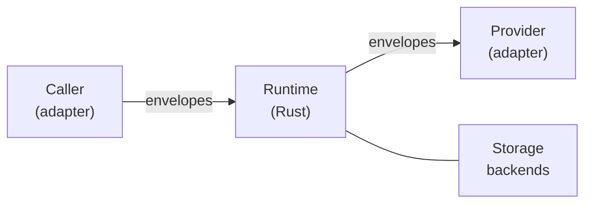
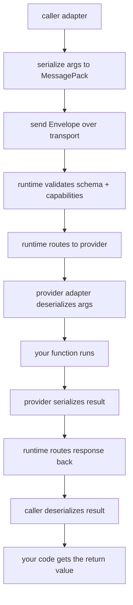

A few core ideas make everything else click into place.

::: grids
::: grid
::: card "Transport Agnostic Protocol" icon:radio
Same MessagePack wire format whether you are in-process, on a Unix socket, or across a WebSocket.
:::
:::
::: grid
::: card "Strict Schema Model" icon:file-text
Every function, type, and capability is declared up front. The runtime validates every call against the schema.
:::
:::
::: grid
::: card "Language Adapters" icon:code
Thin clients in each language handle serialization and expose a native API. The runtime handles routing and policy.
:::
:::
::: grid
::: card "Six Invocation Primitives" icon:zap
Call, cast, stream, channel, batch, and resource cover the full range of communication patterns.
:::
:::
::: grid
::: card "Dev Mode Discovery" icon:search
Providers announce their schema automatically. No codegen step until you freeze for production.
:::
:::
::: grid
::: card "WASM Native" icon:globe
The runtime, providers, and storage backends all compile to WASM. Same protocol in the browser.
:::
:::
:::

## Architecture

Saikuro has four moving parts:



### Runtime

A Rust process (or WASM module) that sits in the middle. It:

- Loads and validates schemas
- Routes invocations to the right provider
- Enforces capabilities and visibility
- Manages transports, concurrency, and storage

Every invocation passes through the runtime. Adapters never talk to each other directly.

### Adapters

Thin clients in each supported language. An adapter's only job:

- Serialize arguments and return values to MessagePack
- Register local functions as provider handlers
- Surface a clean native API

Adapters do not do routing, schema validation, or capability enforcement. That is all in the runtime.

### Schema

A static description of everything callable:

- Functions (arguments, return type, visibility)
- Types (struct shapes, enums)
- Namespaces (function grouping)
- Capabilities (what token a caller needs)

In development, providers announce their schema automatically. In production you freeze the schema and generate typed bindings.

### Protocol

MessagePack-encoded envelopes. Every message has a defined shape. See the [Protocol Reference](../api/) for the full spec.

## Providers and Callers

**Providers** register functions under a namespace and serve them. Each namespace has exactly one provider.

**Callers** connect and invoke functions by fully-qualified name: `namespace.function`.

Any process can be both a provider and a caller at the same time.

## Namespaces

Functions are addressed as `namespace.function`:

```text
math.add
auth.validate_token
images.resize
```

The runtime knows which provider owns which namespace and routes accordingly.

## Execution Backends

The runtime supports three execution backends via the `saikuro-exec` crate:

| Backend | Feature Flag              | Use Case                         |
|---------|---------------------------|----------------------------------|
| Tokio   | `tokio-runtime` (default) | Native Linux/macOS/Windows       |
| WASM    | `wasm-runtime`            | Browser and edge runtimes        |
| Embassy | `embassy-runtime`         | Embedded and no_std environments |

The backends are mutually exclusive. Select one at compile time.

## Storage Backends

The `saikuro-storage` crate provides platform-agnostic storage:

| Backend        | Feature Flag      | Platform                           |
|----------------|-------------------|------------------------------------|
| InMemory       | `inmemory`        | All                                |
| Filesystem     | `fs-storage`      | Native                             |
| SQLite         | `sqlite-storage`  | Native                             |
| Sled           | `sled-storage`    | Native                             |
| IndexedDB      | `wasm-storage`    | WASM (browser)                     |
| OPFS           | `wasm-storage`    | WASM (browser, private)            |
| LocalStorage   | `local-storage`   | WASM (browser)                     |
| SessionStorage | `session-storage` | WASM (browser)                     |
| FsAccess       | `wasm-storage`    | WASM (browser, File System Access) |

All backends share the same [`KeyValueBackend`] and [`FileBackend`] traits, so switching between them is a config change.

## Transports

The transport is how adapters connect to the runtime. Saikuro picks the best one automatically based on the address you provide:

| Address Format    | Transport        | Situation            |
|-------------------|------------------|----------------------|
| `memory://`       | InMemory         | Same-process testing |
| `unix:///path`    | Unix socket      | Same machine         |
| `tcp://host:port` | TCP              | Different machines   |
| `ws://host/path`  | WebSocket        | Browser or network   |
| `wss://host/path` | WebSocket (TLS)  | Secure browser       |
| `wasm-host://`    | BroadcastChannel | Same-origin WASM     |

See [Transports](../guide/transports) for the full details.

## Capabilities and Visibility

**Capabilities** are strings a function can require:

```json
{
  "functions": {
    "delete_user": {
      "capabilities": ["admin.write"]
    }
  }
}
```

Callers present a capability token on connect. The runtime checks it at invocation time.

**Visibility** controls reachability:

| Level      | Who can call      |
|------------|-------------------|
| `public`   | Any caller        |
| `internal` | Same machine only |
| `private`  | Same process only |

## The Execution Flow



The middle six steps are invisible. From your perspective: you called a function and got a value back.

## Next Steps

::: grids
::: grid
::: button "Quick Start" ./quickstart.md icon:play
:::
::: grid
::: button "Invocation Primitives" ../guide/invocations.md icon:zap
:::
::: grid
::: button "Transports" ../guide/transports.md icon:radio
:::
::: grid
::: button "Storage" ../guide/storage.md icon:database
:::
:::
