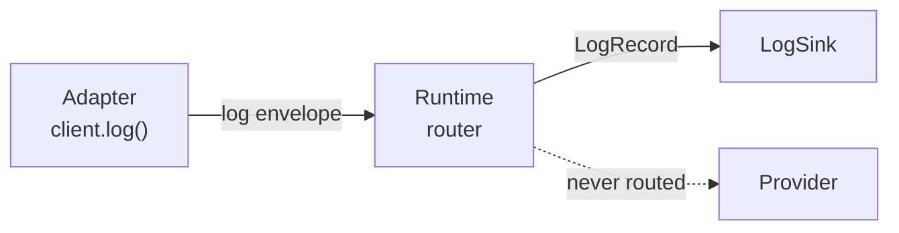

---
title: "Logging"
description: "Structured logging through the Saikuro runtime"
---

Saikuro provides a structured logging system that lets adapters forward log records to the runtime instead of writing directly to stderr. The runtime collects records from all connected adapters and routes them to a configurable log sink.

## Architecture

When an adapter calls `client.log(...)`, it constructs a `LogRecord` and wraps it in a `log`-type envelope. The runtime intercepts `log` envelopes before they reach any provider and dispatches them to the configured sink.



## LogRecord

Each log record carries a timestamp, severity level, origin name, message, and optional structured fields:

| Field    | Type   | Description                                   |
|----------|--------|-----------------------------------------------|
| `ts`     | string | ISO-8601 timestamp                            |
| `level`  | string | `trace`, `debug`, `info`, `warn`, `error`     |
| `name`   | string | Logger name / origin (e.g. `"myapp.handler"`) |
| `msg`    | string | Human-readable message                        |
| `fields` | object | Optional structured context (key-value pairs) |

### Log Levels

Ordered from least to most severe:

| Level   | Usage                                          |
|---------|------------------------------------------------|
| `trace` | Very detailed diagnostic information           |
| `debug` | General debugging information                  |
| `info`  | Normal operational messages                    |
| `warn`  | Unexpected but handled situations              |
| `error` | Failure conditions that should be investigated |

## Adapter API

All six adapters provide a `log()` method on the client:

```typescript
// TypeScript
await client.log("info", "myapp", "started", { version: "1.0" });
```

```python
# Python
await client.log("info", "myapp", "started", {"version": "1.0"})
```

```rust
// Rust
client.log(LogLevel::Info, "myapp", "started", Some(&json!({"version": "1.0"}))).await?;
```

```csharp
// C#
await client.LogAsync("info", "myapp", "started", new { version = "1.0" });
```

```c
// C
saikuro_client_log(client, "info", "myapp", "started", "{\"version\": \"1.0\"}");
```

```cpp
// C++
client.log("info", "myapp", "started", "{\"version\": \"1.0\"}");
```

### Automatic Log Forwarding (TypeScript)

The TypeScript adapter provides helpers to forward all log calls from your logger to the Saikuro runtime:

```typescript
import { createLoggingHandler, wrapLogger } from "@nisoku/saikuro/logging_handler";
import { SaikuroClient } from "@nisoku/saikuro";

const client = await SaikuroClient.connect("unix:///tmp/saikuro.sock");

// Create a forwarding handler
const handler = createLoggingHandler(client.transport);
handler("info", "myapp", "started", { version: "1.0" });

// Wrap an existing logger (console, pino, etc.)
const wrapped = wrapLogger(client.transport, console);
wrapped.info("hello"); // forwards to Saikuro AND prints to console
```

You can also forward all internal adapter logs to the runtime:

```typescript
import { setLogSink, createTransportSink } from "@nisoku/saikuro";

const client = await SaikuroClient.connect("unix:///tmp/saikuro.sock");
setLogSink(createTransportSink(client));
```

## Runtime Configuration

### Log Level

Control the minimum log level via the `SAIKURO_LOG` environment variable or the `--log-level` flag:

```bash
SAIKURO_LOG=debug saikuro-runtime
saikuro-runtime --log-level debug
```

### JSON Output

For log aggregation tools, emit logs as newline-delimited JSON:

```bash
saikuro-runtime --json-logs
```

### Custom Log Sink

The runtime uses a `tracing`-backed log sink by default. Rust applications can provide a custom sink:

```rust
use saikuro_router::tracing_log_sink;
use saikuro_core::log::{LogRecord, LogSink};

let sink: LogSink = Box::new(|record: LogRecord| {
    // Forward to your logging system
});
```

## Log Envelope

Log records are transmitted as standard Saikuro envelopes:

```json
{
  "version": 1,
  "type": "log",
  "id": "log-2026-01-01T00:00:00.000Z",
  "target": "$log",
  "args": [{
    "ts": "2026-01-01T00:00:00.000Z",
    "level": "info",
    "name": "myapp",
    "msg": "started",
    "fields": { "version": "1.0" }
  }]
}
```

Log envelopes fire-and-forget. The runtime never sends a response.

## Next Steps

::: grids
::: grid
::: button "Protocol Reference" ../api/ icon:box
:::
::: grid
::: button "Error Handling" ./errors.md icon:alert
:::
::: grid
::: button "Transports" ./transports.md icon:radio
:::
:::
