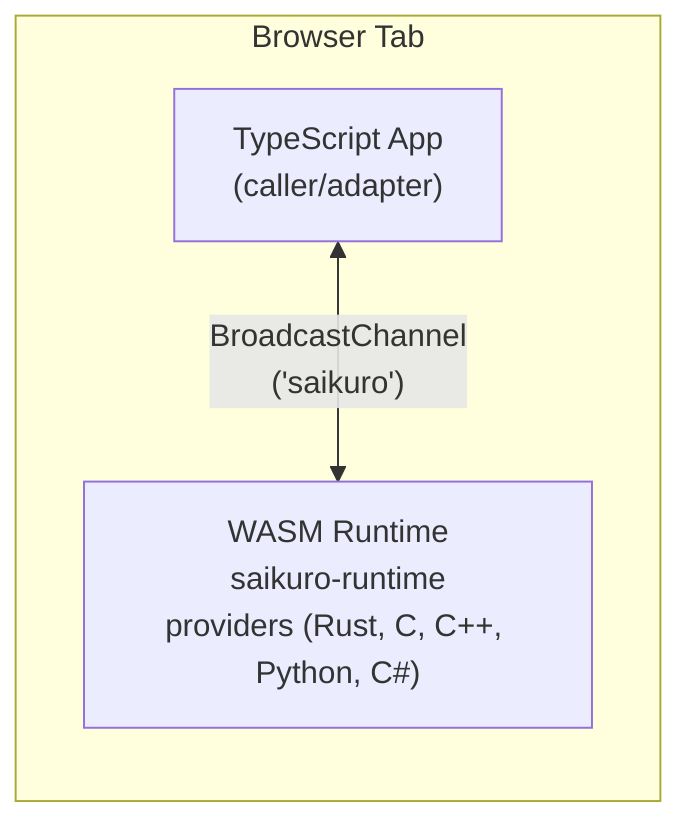

---
title: "WASM"
description: "Run Saikuro entirely in the browser via WebAssembly"
---

Saikuro compiles to WebAssembly. The runtime, providers, and adapters all run in the browser with no server needed.

## Architecture

In a WASM environment, the typical setup is:



The WasmHost transport uses the [BroadcastChannel API](https://developer.mozilla.org/en-US/docs/Web/API/BroadcastChannel) to bridge the TypeScript adapter and the WASM runtime. They communicate over the same-origin message passing channel using the standard Saikuro envelope format.

## WasmHost Transport

```typescript
import { WasmHostTransport } from "@nisoku/saikuro";

// Connect via the default "saikuro" channel
const client = await SaikuroClient.connect("wasm-host://saikuro");
```

The WasmHost transport implements the standard `Transport` interface. It serializes envelopes to MessagePack and sends them over a BroadcastChannel.

## Building for WASM

### Runtime

```bash
just wasm-rust-runtime
```

### Rust Providers

```bash
just wasm-rust-provider
```

### C/C++ Providers

```bash
just wasm-c     # C provider
just wasm-cpp   # C++ provider
```

### Python Providers

Python in the browser runs via Pyodide. See the [Demo source](https://github.com/Nisoku/Saikuro/tree/wasm-stuff/Demo) for an example of Pyodide integration.

### C# Providers

C# in the browser runs via Blazor WASM with a specialized BroadcastChannel transport:

```csharp
// Uses BroadcastChannelInterop to bridge Blazor and the Saikuro runtime
var transport = new WasmHostTransport("saikuro");
```

## Storage in WASM

The `saikuro-storage` crate provides browser-native storage backends:

| Backend        | Persistence           | Scope          |
|----------------|-----------------------|----------------|
| IndexedDB      | Durable, large        | Cross-tab      |
| OPFS           | Durable, private      | Origin private |
| LocalStorage   | Durable, small        | Cross-tab      |
| SessionStorage | Session only          | Per-tab        |
| FsAccess       | Durable, user-granted | Per-file       |

```rust
use saikuro_storage::IndexedDbStorage;

let storage = IndexedDbStorage::new()?;
storage.put("notes", "entry-1", b"hello".into()).await?;
```

## Execution Backend

When compiling for WASM, use the `wasm-runtime` feature to select the WASM execution backend:

```toml
[dependencies]
saikuro-exec = { version = "0.1", features = ["wasm-runtime"] }
```

This backend provides a WASM-compatible executor that does not depend on platform threads or blocking I/O.

## Demo

The [Demo application](https://github.com/Nisoku/Saikuro/tree/wasm-stuff/Demo) shows a full WASM setup:

- TypeScript UI (Vite)
- WASM-compiled runtime
- Providers in Rust, C, C++, C#, and Python (via Pyodide)
- All communicating over WasmHost transport

To run the demo:

```bash
just wasm-all       # build all WASM modules
just web_demo dev   # build + start dev server
```

## Next Steps

::: grids
::: grid
::: button "Transports" ./transports.md icon:radio
:::
::: grid
::: button "Storage" ./storage.md icon:database
:::
::: grid
::: button "Installation" ../getting-started/installation.md icon:download
:::
:::
